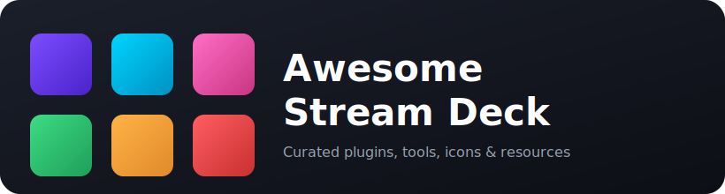

# Awesome Stream Deck 

> A curated list of awesome plugins, tools, libraries, icons, and resources for the Elgato Stream Deck.

  

The [Stream Deck](https://www.elgato.com/us/en/p/stream-deck) is a programmable control surface with customizable LCD keys, dials, and a vibrant ecosystem of plugins. This list collects the best software, developer tooling, and creative resources for getting the most out of it, whether you stream, work, automate your home, game, or build your own plugins.

## Contents

- [Official Resources](#official-resources)
- [Plugins for Streaming and Recording](#plugins-for-streaming-and-recording)
- [Plugins for Audio and Music](#plugins-for-audio-and-music)
- [Plugins for Communication and Meetings](#plugins-for-communication-and-meetings)
- [Plugins for Productivity and Development](#plugins-for-productivity-and-development)
- [Plugins for Home and Network Automation](#plugins-for-home-and-network-automation)
- [Plugins for Monitoring and Status](#plugins-for-monitoring-and-status)
- [Plugins for Gaming and Simulation](#plugins-for-gaming-and-simulation)
- [Developer Libraries and SDKs](#developer-libraries-and-sdks)
- [Open-Source Software and Alternatives](#open-source-software-and-alternatives)
- [Hardware and DIY](#hardware-and-diy)
- [Icons and Visual Resources](#icons-and-visual-resources)
- [Guides and Tutorials](#guides-and-tutorials)
- [Community](#community)

## Official Resources

- [Stream Deck SDK](https://docs.elgato.com/streamdeck/sdk/introduction/getting-started/) - Official documentation and tooling for building plugins.
- [Stream Deck Node SDK](https://github.com/elgatosf/streamdeck) - Official TypeScript and Node.js SDK for creating plugins.
- [Stream Deck CLI](https://github.com/elgatosf/cli) - Official command-line tool to scaffold, test, and bundle plugins.
- [Plugin Samples](https://github.com/elgatosf/streamdeck-plugin-samples) - Official sample plugins that demonstrate the SDK.
- [Elgato Marketplace](https://marketplace.elgato.com/stream-deck) - Official store for plugins, icon packs, and profiles.
- [Stream Deck App](https://www.elgato.com/us/en/s/downloads) - Official desktop software for Windows and macOS.

## Plugins for Streaming and Recording

- [OBS Studio](https://marketplace.elgato.com/product/obs-studio-35615969-830f-45c9-ba0a-1a295bba7fec) - Control scenes, sources, recording, and streaming in OBS Studio.
- [Twitch](https://marketplace.elgato.com/product/twitch-54e38b3b-89ab-4400-b55f-645378785709) - Send chat messages, create clips and markers, and track viewers.
- [OBS Studio Plugin (source)](https://github.com/elgatosf/streamdeck-obs-plugin2) - Open-source code for the official OBS Studio integration.
- [Multi OBS Controller](https://github.com/theca11/multi-obs-controller) - Control multiple OBS instances at once from a single key.
- [Meld Studio](https://github.com/MeldStudio/streamdeck) - Official plugin to control scenes and audio in Meld Studio.
- [vMix](https://github.com/FlowingSPDG/streamdeck-vmix-plugin) - Control vMix inputs, overlays, and transitions.
- [Meme Box](https://github.com/negue/meme-box) - Manage and trigger media as OBS browser sources from your keys.

## Plugins for Audio and Music

- [Spotify](https://marketplace.elgato.com/product/spotify-integration-windows-5e3a6d60-570a-40f3-b186-dbcd122216a2) - Manage playback, volume, and your library from keys and dials.
- [Wave Link](https://marketplace.elgato.com/product/wave-link-aa41150f-9645-4275-b064-7642ba6a17ae) - Control your Wave Link audio mix, faders, and outputs.
- [Audio Switcher](https://www.elgato.com/us/en/explorer/products/marketplace/audio-switcher-plugin/) - Switch the default audio input or output device with one key.
- [Sound Deck](https://github.com/GeekyEggo/SoundDeck) - Audio-focused plugin with soundboard, recording, and playback actions.
- [YouTube Music](https://github.com/XeroxDev/YTMD-StreamDeck) - Control the YouTube Music Desktop app from your keys.
- [VLC](https://github.com/RGPaul/streamdeck-vlc) - Control VLC media player playback.
- [Audio Swap](https://github.com/brendanwelsh/streamdeck-audioswap) - Swap the default audio output device and control master volume from a dial.

## Plugins for Communication and Meetings

- [Discord](https://marketplace.elgato.com/product/discord-e3559f36-d31d-4529-ab1f-739955e2ac7a) - Toggle mute, deafen, push-to-talk, and switch voice channels.
- [Google Meet](https://github.com/ChrisRegado/streamdeck-googlemeet) - Manage your Google Meet microphone and camera.
- [Stream Deck Meet](https://github.com/petele/StreamDeck-Meet) - Add Google Meet control over WebHID without an extra app.

## Plugins for Productivity and Development

- [Advanced Launcher](https://marketplace.elgato.com/product/advanced-launcher-d9a289e4-9f61-4613-9f86-0069f5897125) - Launch apps, files, and scripts with custom arguments and working directories.
- [Clockify](https://github.com/eXpl0it3r/streamdeck-clockify) - Start, stop, and track Clockify time entries.
- [iCal](https://github.com/pedrofuentes/stream-deck-ical) - Show upcoming events from an iCal calendar feed.
- [Web Requests](https://github.com/data-enabler/streamdeck-web-requests) - Send HTTP requests to any API or webhook.
- [AppleScript](https://github.com/mushoo/streamdeck-applescript) - Run arbitrary AppleScript from a key on macOS.
- [Shortcuts](https://github.com/SENTINELITE/StreamDeck-Shortcuts) - Run Apple Shortcuts directly from a key.
- [Keyboard Maestro](https://github.com/Corcules/KMlink) - Trigger Keyboard Maestro macros on macOS.
- [Obsidian](https://github.com/j4ckofalltrades/obsideck) - Run Obsidian commands from a key.
- [JetBrains IDEs](https://github.com/JetBrains/intellij-streamdeck-plugin) - Trigger IntelliJ-based IDE actions with live status feedback.
- [VS Code Deck](https://github.com/ugaya40/vscode-deck) - Run VS Code commands and npm scripts from a key.
- [Window Actions](https://github.com/aasmal97/Window-Actions) - Move, resize, and switch windows and virtual desktops on Windows.
- [File Explorer](https://github.com/ArtusLama/streamdeck-fileexplorer) - Browse, preview, and open files and folders from your keys.
- [OTP](https://github.com/gri-gus/otp-streamdeck-plugin) - Generate one-time passwords like an authenticator app.
- [Stopwatch](https://github.com/gabe565/streamdeck-stopwatch) - Start, stop, and reset a stopwatch on a key.
- [Jira](https://github.com/mediabounds/streamdeck-jira) - Surface Jira issues, Confluence content, and JSM alerts.

## Plugins for Home and Network Automation

- [Philips Hue](https://marketplace.elgato.com/product/philips-hue-27f49792-2de3-455f-8892-fd382716f548) - Control Philips Hue lights, scenes, and brightness.
- [Home Assistant](https://github.com/cgiesche/streamdeck-homeassistant) - Control any Home Assistant entity and view its live state.
- [Home Assistant YAML](https://github.com/basnijholt/home-assistant-streamdeck-yaml) - Cross-platform Home Assistant control configured entirely in YAML.
- [Home Assistant Add-on](https://github.com/basnijholt/home-assistant-streamdeck-yaml-addon) - Run the YAML-based Home Assistant controller as a native add-on.
- [Node-RED](https://github.com/ybizeul/StreamDeckWS) - Web-services proxy that connects your keys to Node-RED flows.
- [MQTT Bridge](https://github.com/LukasOchmann/streamdeck-mqtt) - Run a deck as a standalone Home Assistant controller over MQTT, no PC required.
- [Pi-hole](https://github.com/johnholbrook/streamdeck-pihole) - Monitor and control a Pi-hole network ad blocker.
- [Bluetooth LE](https://github.com/cael-gomes/streamdeck-ble-plugin) - Scan for and send commands to Bluetooth Low Energy devices.
- [Camera Dials](https://github.com/brendanwelsh/streamdeck-cameradials) - Scroll RTSP and UniFi Protect cameras into an mpv viewer from a dial.

## Plugins for Monitoring and Status

- [HWiNFO Reader](https://github.com/5e/streamdeck-hwinfo-plugin) - Show HWiNFO hardware sensor readings on your keys.
- [DevOps](https://github.com/SantiMA10/devops-streamdeck) - Monitor the status of your CI/CD pipelines.
- [Docker](https://github.com/Darkdragon14/streamdeck-docker) - Start, stop, and monitor Docker containers.
- [Stock Ticker](https://github.com/shayne/stock-ticker-stream-deck-plugin) - Display live stock prices on a key.
- [Nightscout](https://github.com/gabe565/streamdeck-nightscout) - Display live blood-glucose readings from a Nightscout server.
- [TeslaFi](https://github.com/f00d4tehg0dz/Teslafi-Status-Plugin-for-Eglato-Streamdeck) - Show live Tesla vehicle stats via TeslaFi or TeslaMate.

## Plugins for Gaming and Simulation

- [Flight Tracker](https://github.com/nguyenquyhy/Flight-Tracker-StreamDeck) - Interact with Microsoft Flight Simulator from your keys.
- [PilotsDeck](https://github.com/Fragtality/PilotsDeck) - Control flight simulators directly from your keys.
- [DCS Interface](https://github.com/enertial/streamdeck-dcs-interface) - Integrate with Digital Combat Simulator cockpits.
- [XIVDeck](https://github.com/KazWolfe/XIVDeck) - Rich integration for Final Fantasy XIV.
- [Destiny Item Manager](https://github.com/dim-stream-deck/com.dim.streamdeck) - Manage your Destiny 2 inventory through Destiny Item Manager.
- [Simulator Controller](https://github.com/SeriousOldMan/Simulator-Controller) - AI-based pit crew and controller for sim racing.
- [SimHub Plugin](https://github.com/pre-martin/StreamDeckSimHubPlugin) - Keep your keys in sync with SimHub telemetry.
- [TrackAudio](https://github.com/neilenns/streamdeck-trackaudio) - Control TrackAudio for VATSIM air-traffic-control voice.
- [vJoy](https://github.com/ashupp/Streamdeck-vJoy) - Map keys to virtual joystick buttons.

## Developer Libraries and SDKs

- [StreamDeck Tools](https://github.com/BarRaider/streamdeck-tools) - Widely used C# and .NET library that wraps the plugin protocol.
- [StreamDeckSharp](https://github.com/OpenMacroBoard/StreamDeckSharp) - Simple .NET wrapper for controlling hardware directly.
- [python-elgato-streamdeck](https://github.com/abcminiuser/python-elgato-streamdeck) - Python library to drive hardware over USB HID.
- [node-elgato-stream-deck](https://github.com/Julusian/node-elgato-stream-deck) - Node.js library for devices, including WebHID.
- [streamdeck-python-sdk](https://github.com/gri-gus/streamdeck-python-sdk) - Typed Python SDK for building plugins.
- [StreamDeckPlugin](https://github.com/emorydunn/StreamDeckPlugin) - Library for creating plugins in Swift.
- [streamdeck-rs](https://github.com/mdonoughe/streamdeck-rs) - Unofficial Rust SDK for writing plugins.
- [rust-elgato-streamdeck](https://github.com/OpenActionAPI/rust-elgato-streamdeck) - Rust library for interacting with hardware.
- [streamdeck (Go)](https://github.com/dh1tw/streamdeck) - Go API for Elgato and Corsair devices.
- [StreamDeckCore](https://github.com/VVEIRD/StreamDeckCore) - Java implementation for the device.
- [DeckSurf SDK](https://github.com/dend/decksurf-sdk) - .NET SDK for programming devices without the Elgato app.
- [sdpi-components](https://github.com/GeekyEggo/sdpi-components) - Web components that simplify building plugin property inspectors.

## Open-Source Software and Alternatives

- [Bitfocus Companion](https://github.com/bitfocus/companion) - Turn a deck into a control surface for broadcast gear and software.
- [Companion Satellite](https://github.com/bitfocus/companion-satellite) - Connect remote decks to a Companion instance over the network.
- [OpenDeck](https://github.com/nekename/OpenDeck) - Cross-platform app that runs original Elgato plugins on Linux, Windows, and macOS.
- [Macro Deck](https://github.com/SuchByte/Macro-Deck) - Free software that turns an Android device into a customizable macro pad.
- [StreamController](https://github.com/StreamController/StreamController) - Elegant Linux app with plugin support.
- [streamdeck-linux-gui](https://github.com/streamdeck-linux-gui/streamdeck-linux-gui) - GUI for configuring devices on Linux.
- [Code Deck](https://github.com/hagronnestad/code-deck) - Cross-platform open-source alternative to the official app.
- [DeckSurf](https://github.com/dend/DeckSurf) - Open command-line tooling to control devices.
- [deckmaster](https://github.com/muesli/deckmaster) - Lightweight application to control a deck on Linux.
- [ideckia](https://github.com/ideckia/ideckia) - Cross-platform server that turns phones and browsers into a deck.
- [SuperConductor](https://github.com/SuperFlyTV/SuperConductor) - Playout client that controls CasparCG, ATEM, OBS, vMix, OSC, and more.
- [Touch Portal](https://www.touch-portal.com/) - Macro-deck app for Android, iOS, and desktop with a large plugin library.

## Hardware and DIY

- [Starkpad](https://github.com/BlommeJan/Starkpad) - Fully open-source, 3D-printable Stream Deck alternative.
- [FreeDeck](https://github.com/FreeYourStream/freedeck-hardware) - Open-source DIY macro pad with hardware, firmware, and a configurator.
- [DIY Stream Deck](https://github.com/SuperMakeSomething/diy-stream-deck) - Arduino-based build with a full instructional video and source.
- [DIYStreamDeck](https://github.com/LennartHennigs/DIYStreamDeck) - ESP32-based macro pad that sends keystrokes over USB HID.

## Icons and Visual Resources

- [Elgato Marketplace Icons](https://marketplace.elgato.com/stream-deck/icons) - Official catalog of free and paid icon packs.
- [Icons8 Stream Deck Icons](https://icons8.com/icons/set/stream-deck) - Large library of consistent icons sized for the device.
- [Fluent UI Icon Pack](https://github.com/czottmann/streamdeck-iconpack-fluentui-system-icons) - Free icon packs based on Microsoft Fluent UI System Icons.
- [Lovely Sim Racing Icons](https://github.com/Lovely-Sim-Racing/lovely-streamdeck-icons) - Collection of sim racing icons.
- [Nerd or Die Free Icons](https://nerdordie.com/blog/editorial/free-stream-deck-icon-pack/) - Free pack of polished icons for Stream Deck and Touch Portal.

## Guides and Tutorials

- [Plugin Environment Overview](https://docs.elgato.com/streamdeck/sdk/introduction/plugin-environment/) - How plugins run and communicate with the app.
- [Best Plugins for Streaming](https://www.elgato.com/us/en/explorer/products/stream-deck/stream-deck-plugins-for-streaming/) - Elgato's curated guide to streaming plugins.
- [Best Plugins for Productivity](https://www.elgato.com/us/en/explorer/products/stream-deck/best-stream-deck-plugins-for-productivity/) - Elgato's curated guide to productivity plugins.

## Community

- [r/elgato](https://www.reddit.com/r/elgato/) - Subreddit for Stream Deck and other Elgato gear.
- [Stream Deck Plugins](https://streamdeck-plugins.com/) - Community-curated index of notable plugins.

## Contributing

Contributions are welcome! Read the [contribution guidelines](contributing.md) first.
